# 和弦

# 基本概念 

- **和弦：** 三个音或者三个以上的音构成的集体
- **和声：** 由和弦为基础，构成的集体

# 和弦种类

> [!tip]
> 按照定义可以写出大量的和弦，但是经过作曲家的大量尝试，发现好用的几大类就只有三和弦、七和弦以及三和弦与七和弦演变出的其他和弦。

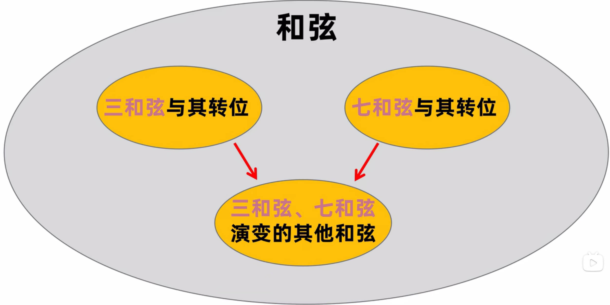

## 三和弦

**定义：** 三个音按照三度叠置的关系形成的和弦。三和弦的三个音根据音高从地到高的顺序称之为根音、三音、五音，且五音与根音直接呈五度关系。

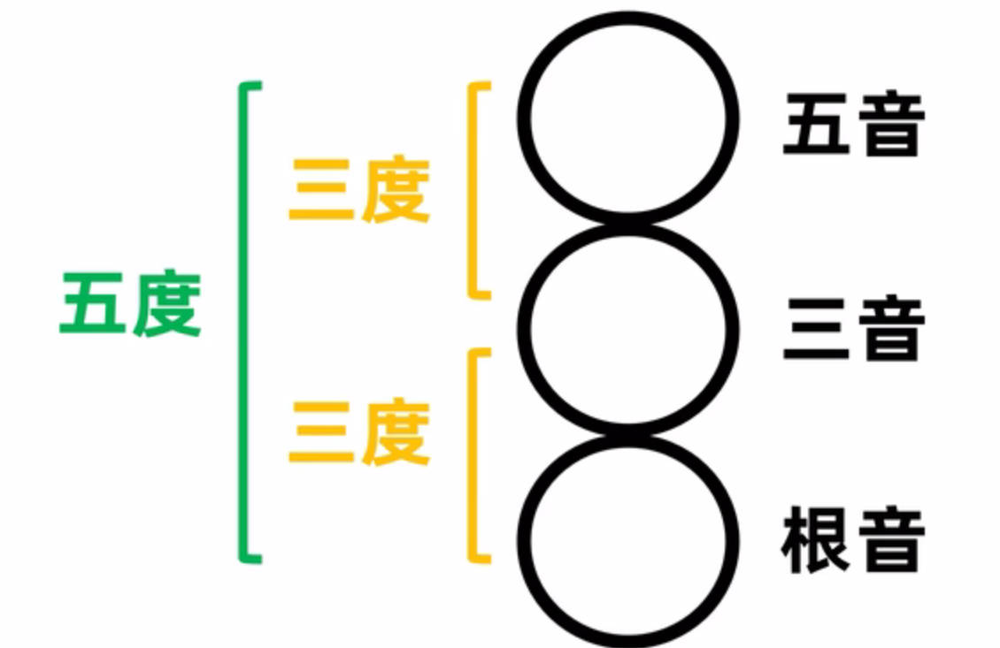

同样经过作曲家的大量尝试，三和弦中常用的也只有四个和弦，即大三和弦、小三和弦、增三和弦、减三和弦。

- 大三和弦：三音与根音是大三度、三音与五音是小三度。相对明亮、温馨
    
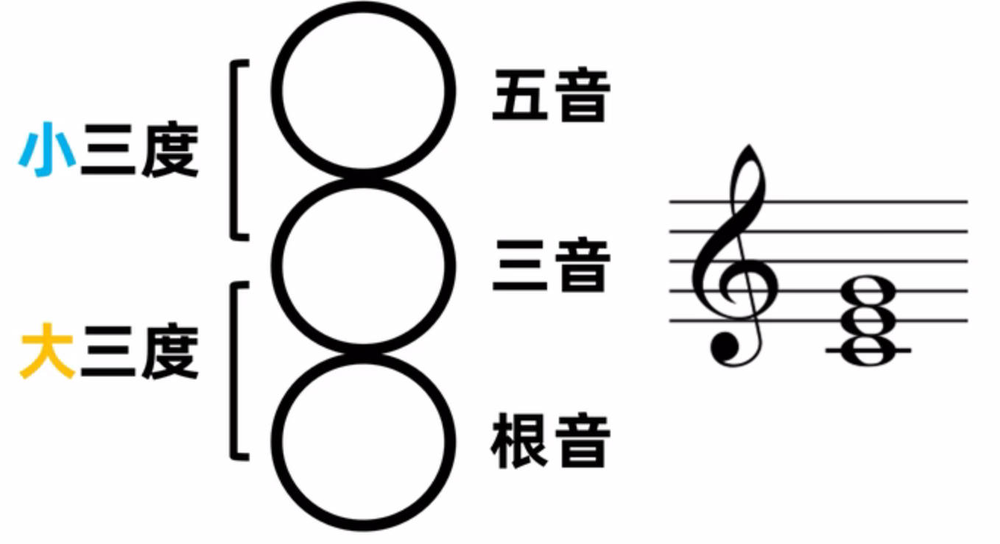

- 小三和弦：三音与根音是小三度、三音与五音是大三度。相对黯淡、忧伤

    
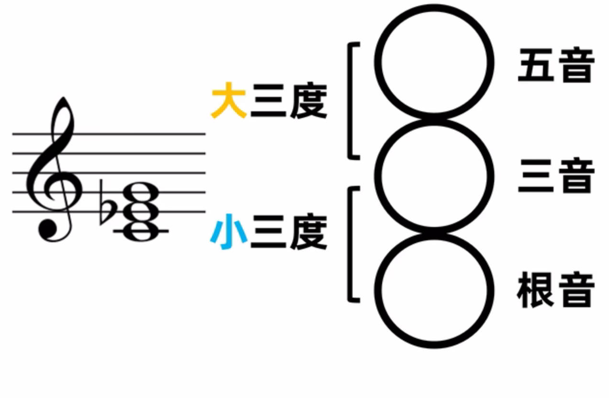

- 增三和弦：三音与根音是大三度、三音与五音是大三度。相对紧张、压抑，因为五音与根音呈增五度关系，属于不协和音程
    
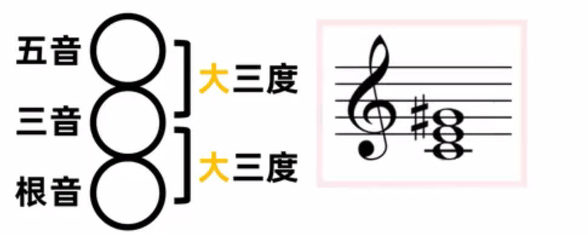

- 减三和弦：三音与根音是小三度、三音与五音是小三度。相对紧张、压抑，因为五音与根音呈减五度关系，属于不协和音程
    
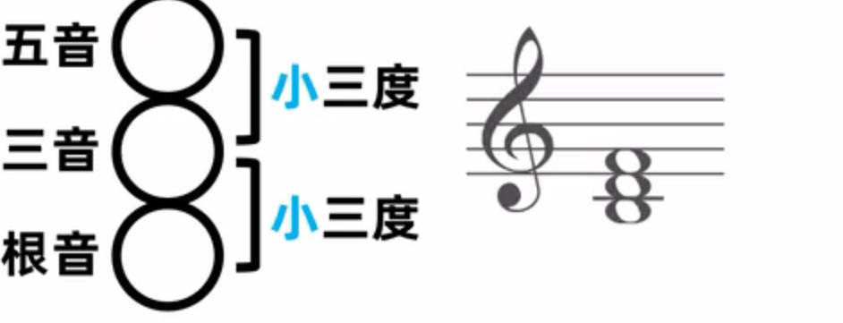

## 三和弦转位

- 第一转位：根音转位，低音与根音为六度，也称之为「六和弦」
- 第二转位：根音与三音转位，低音与根音为四度，低音与三音为六度，也称之为「四六和弦」
- 转位的修饰词与原位保持一致，例如大三和弦的第二转位就是大四六和弦

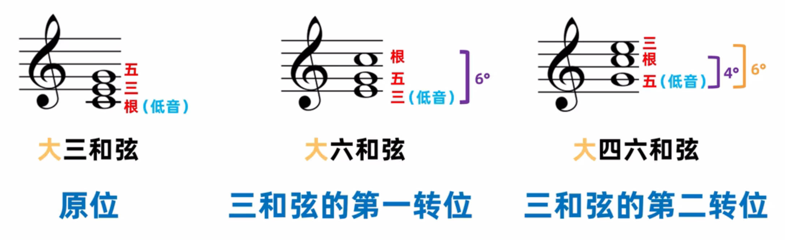

## 七和弦

**定义：** 四个音按照三度叠置的关系构成的和弦。

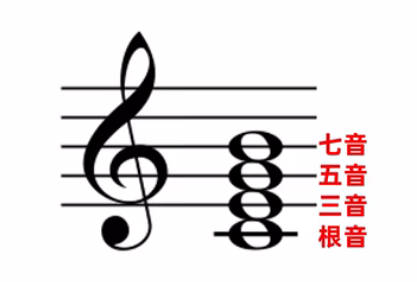

**命名：** AB七和弦
- A: 根三五音形成的是A三和弦
- B：根音与七音构成B七度

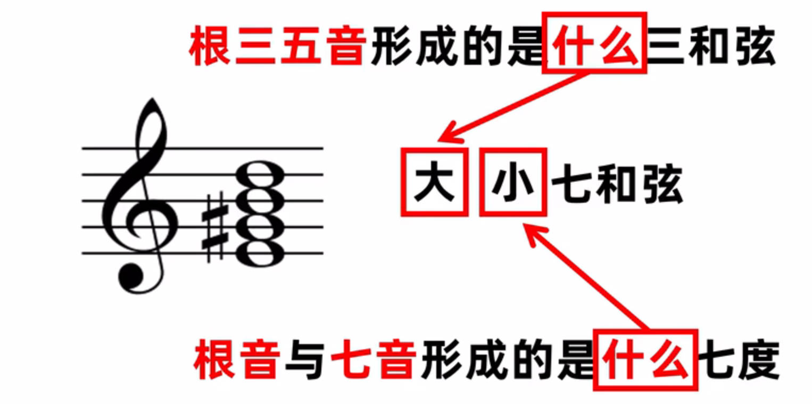

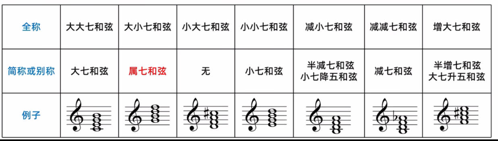

**大七升五和弦：** 将五音降低半音就是大七和弦，因此可以将增大和弦说成是大七升五和弦。小七降五和弦同理，小七和弦的五音降低半音就是减小七和弦。

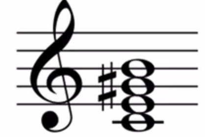

## 七和弦转位

**命名**：低音与七音、根音的度数来命名

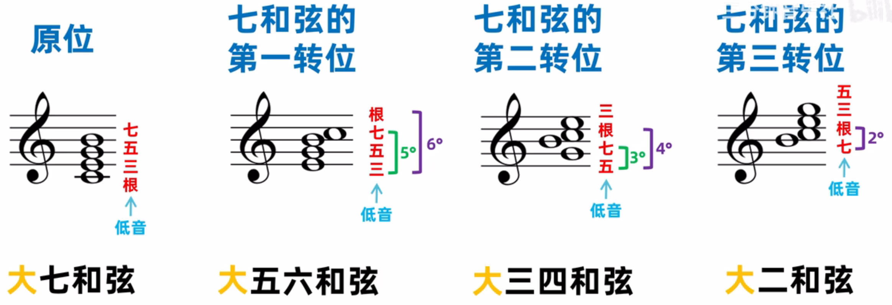

转位首先转根音，由于根音与七音相差七度，转位后根音肯定和七音挨着，且相差两度，因此要确定转位后的根音，肯定要去找呈两度的音。

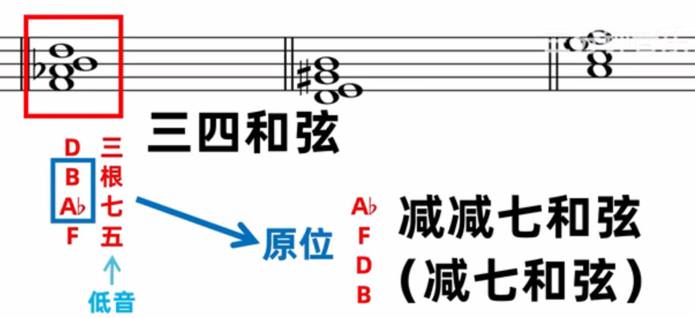

# 和弦标记

## 和弦固定标记法

- 四种三和弦标记：
    
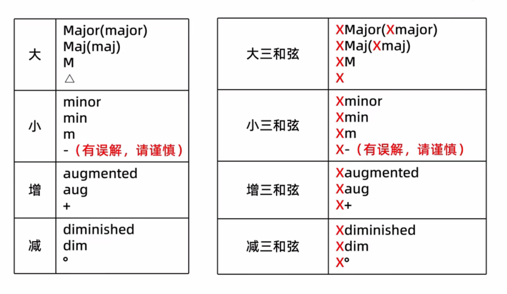

- 七种七和弦标记：
    
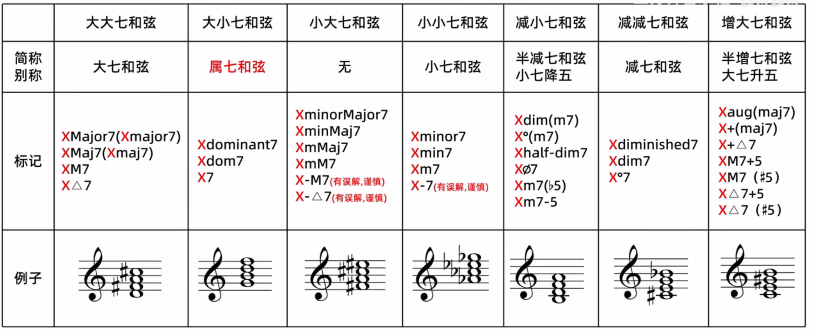

- slash和弦：和弦名 / 低音。用于表示三和弦与七和弦的转位和弦
    
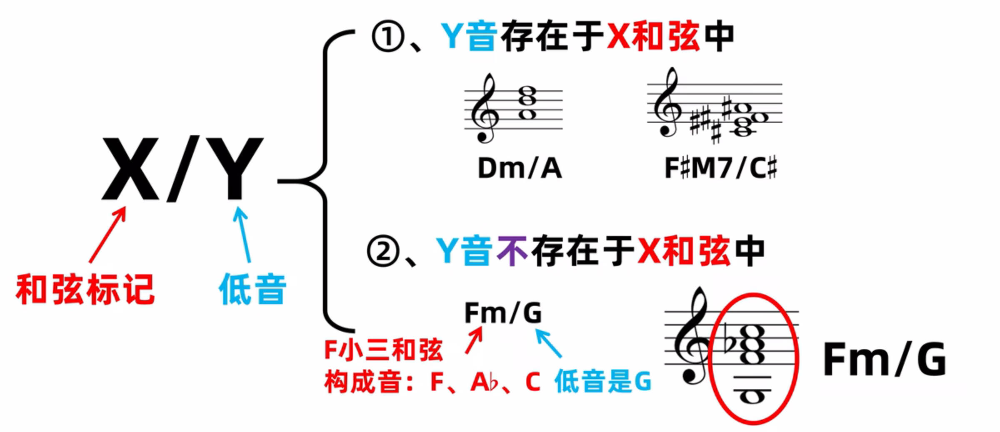

# 广义和弦

上文介绍的所有和弦都是狭义上的和弦定义，广义的和弦只看两部分：**构成音 + 低音**，构成音由狭义和弦定义所确定

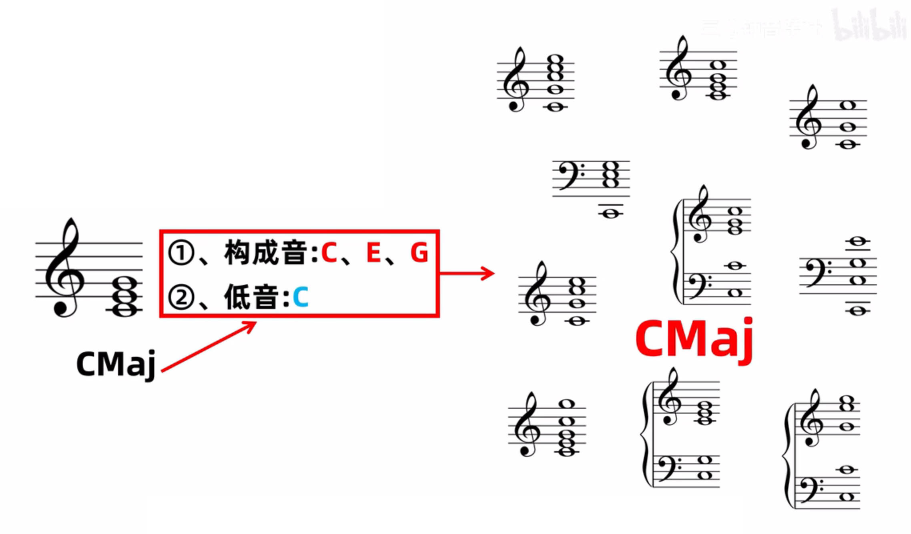

在引入广义和弦的定义后，转位在构建和声就有了很大的作用
1. 和弦的声部变化更加流畅
2. 低音线条的构造

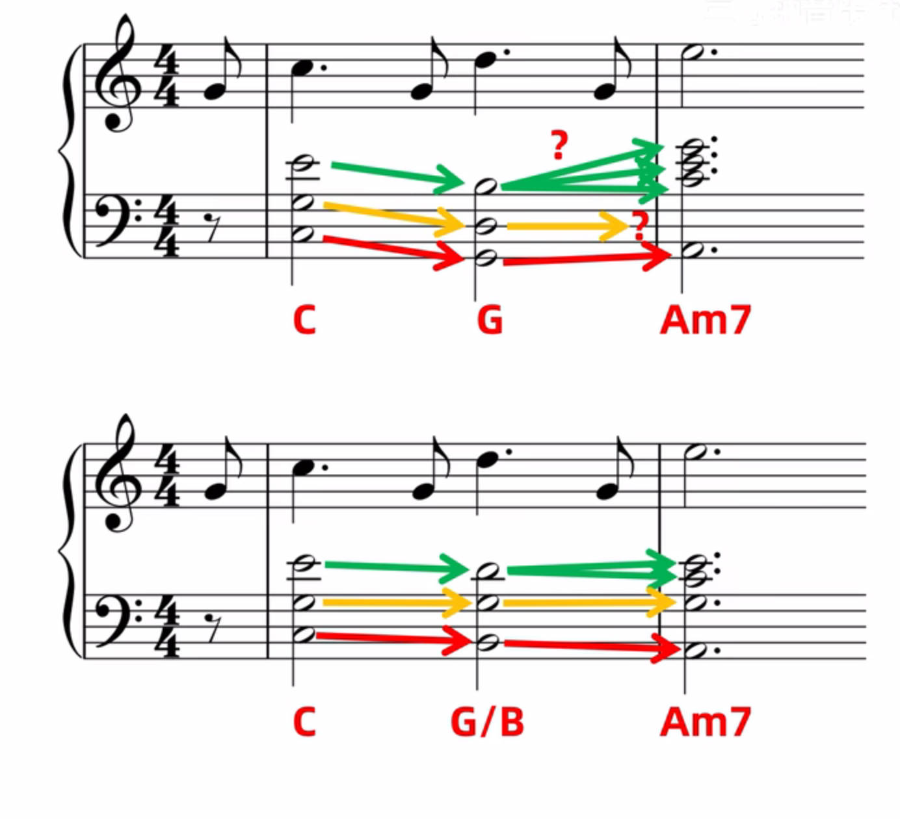

# 和弦织体

- 柱式织体
    
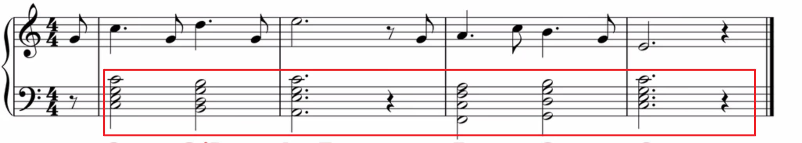

- 分解织体
    
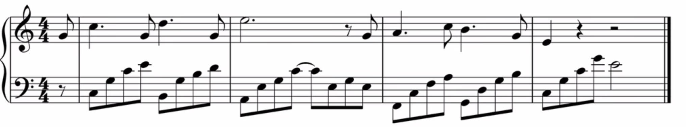

    