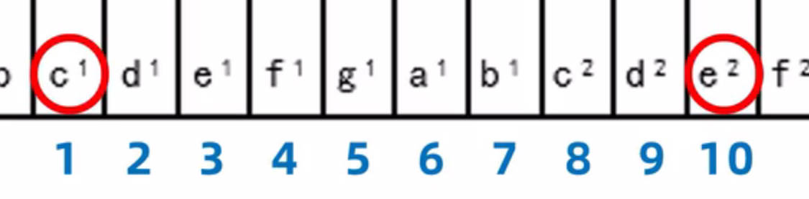
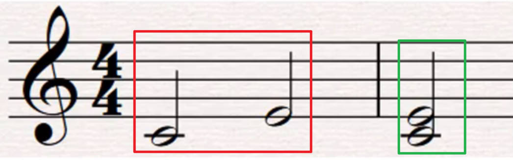
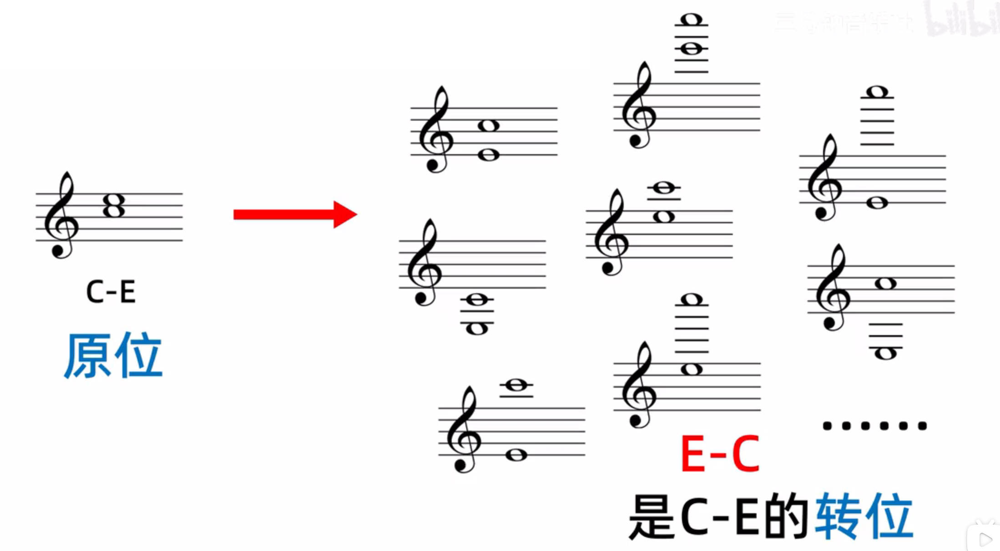

# 音程

# 基本概念

- **音程：** 描述任意两个音之间的距离
    - **根音：** 低音
    - **冠音：** 高音
- **度数：** 描述两个音的距离。忽略所有变音记号，按音名顺序，从「低音」开始，数到「高音」结束，有多少个音名，就是几度
    

- **音数：** 描述两个音距离的具体数值。全音距离值为 1 ；半音距离值为 $\frac{1}{2}$ 或 0.5

> [!note]
> 度数不考虑变音符号；音数需要考虑变音符号

# 音程名

## 定义

**基本音程：**
- **纯一度：** 音数为 0 的一度
- **小二度：** 音数为 0.5 的二度
- **大二度：** 音数为 1 的二度
- **小三度：** 音数为 1.5 的三度
- **大三度：** 音数为 2 的三度
- **纯四度：** 音数为 2.5 的四度
- **纯五度：** 音数为 3.5 的五度
- **小六度：** 音数为 4 的六度
- **大六度：** 音数为 4.5 的六度
- **小七度：** 音数为 5 的七度
- **大七度：** 音数为 5.5 的七度

**扩展音程：** 在基本音程的基础上，通过变音记号改变音数，获得新的音程

例如，通过重降符号，将原来的「小三度」的音数降低 0.5，这样的三度就被命名为「减三度」，同理还能得到增三度、倍增七度、减四度等。

**等音程：** 音数相等的两个音程，就被称之为等音程，即上述表中的一行的所有音程，都互为等音程

## 音程识别

1. 忽略变音记号，查看音程间，是否包含 `EF` 或 `BC` 两组音名
    

    
    例如 `C - G` 的音程，包含的音名有 `CDEFG` 一共五个音名，即五度，并且中间包含 `EF` 查表可知为纯五度

2. 考虑变音记号，在上一步的结论上，增加或降低音数
    

    
    例如 `C - G#` 的音程，根据步骤1可知 `C - G` 是纯五度，由于 `G#`，则需要在纯五度的基础上增加 0.5 的音数，其结果就是增五度

## 八度之外的音程

1. 以八度为单位，依次降低高音，使得高音与低音在八度以内，然后判断八度以内，两个音的音程。图中为大三度
    

2. 以八度为单位，高音降低 `n` 次，就在度数上加 `7n`。图中 e2 降低到 e1 高音降低了 `1` 次八度，又由于 `c1 - e1` 的音程是大三度，那么在此基础上加 `1 * 7`，则 `c1 - e2` 的音程就为大十度
    

## 音程名简写

# 音程性质

## 演奏方式

- **旋律音程：** 两个音先后演奏
- **和声音程：** 两个音同时演奏

## 自然调式

- **自然音程：** 在自然大/小调音阶里直接存在的音程，即两个音均能在调式中找到
    

- **变化音程：** 在自然大/小调音阶里直接不存在的音程，除自然音程以外的所有音程

## 协和性

**协和音程：**
- 极完全协和音程：纯一度、纯八度
- 完全协和音程：纯四度、纯五度
- 不完全协和音程：大三度、小三度、大六度、小六度

**不协和音程：** 除上面音程以外的所有音程

> [!note]
> 等音与等音程其实并不相等，只是在十二平均律将其进行了简化使得看起来是一样，例如 `#E` 与 `F`这两个音的频率是完全不一样，只是十二平均律进行了简化。因此，`C - Ab` 与 `C - G#` 其实应当视作是两个不同的音程(虽然按照十二平均律而言，它们是一样的)

# 音程转位

**转位：** 改变音程中的音的高低顺序。

由于转位可以写出很多个，为了简化操作，一般意义上的转位是指原位中的某个音位置不变，将另外一个音进行转位，形成新的高低音顺序，**并不是单纯的升高或者降低八度，例如纯八度的转位，高音得降低两次八度**

**性质：**
- 通过转位判断原位的音程名：**只适用于音数 $ < 6$ 的音程名，纯八度就不再适用**
  - 大 - 小；纯 - 纯；增 - 减；倍增 - 倍减
  - 原位与转位的度数之和为 9
- 原位与转位的各类性质不变
