# 调号

# 钢琴

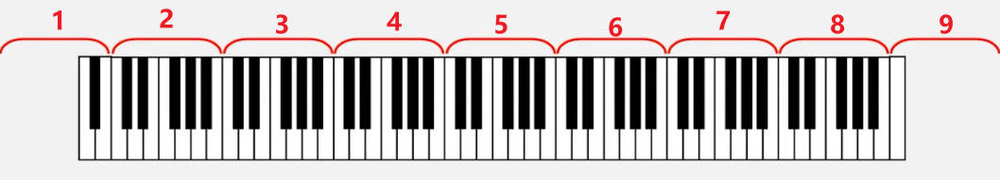

钢琴的按键一般一共有 `88` 个按键，并且可以划分为 `9` 组，并且每一组的基本结构为

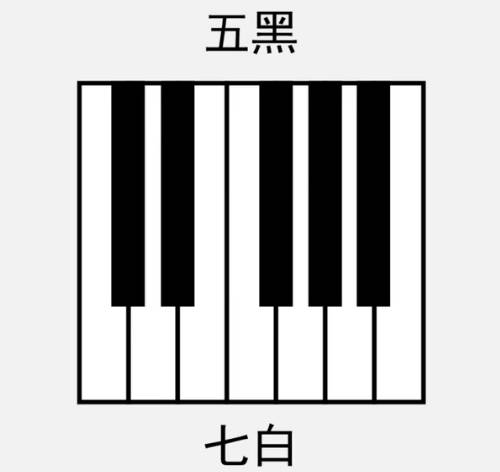

对于这些按键，在描述的时候不可能通过具体的音高(单位`Hz`)来区分，所以人为的给这些音取了七个名字，即「音名」。**这七个音名在钢琴键中的每一个组中都一样，即每组中七个白键的名字，然后在配合变音符号，又能给出五个黑键的音名。**

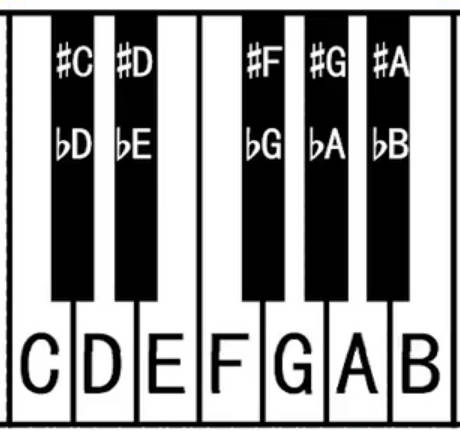

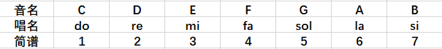

每一组有七个白键和五个黑键，`7 + 5 = 12`，**即这十二按键其实就是十二平均律中的十二个音。钢琴按键又划分了九组，这九组其实就是实现了十二个音的高低音。**

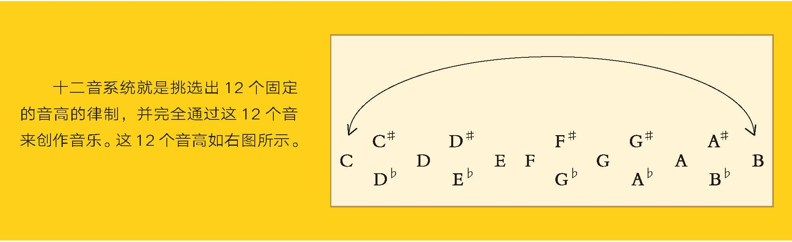

# 音的基本定义

## 乐音/噪音 

- **乐音：** 规则震动，频率稳定，例如钢琴每个琴键发出的音，频率都是固定的

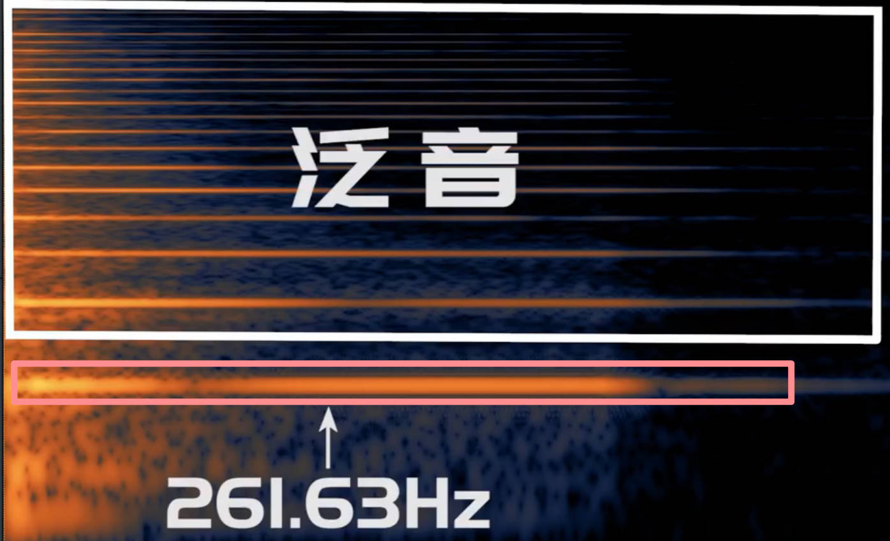

- **噪音：** 震动不规则，频率不稳定，例如鼓发出的声音，没有明显独立的频率

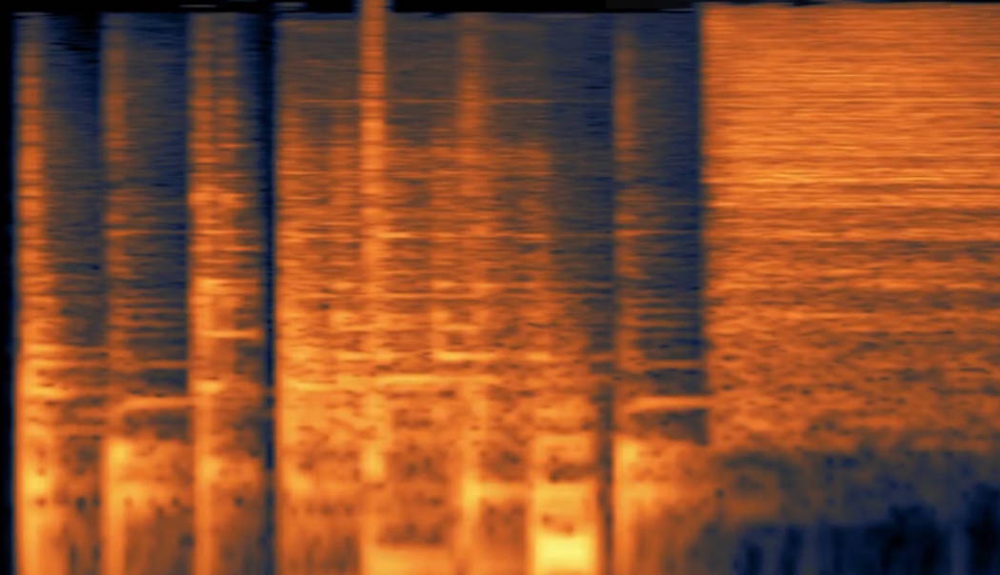

- **乐音体系：** 音乐中所有乐音的总和。一般指的是钢琴能发出的`88`音（88个键位）。

## 音列/音级

- **音列：** 在乐音体系中，取若干乐音，并有序的排列起来（按照音高升序或者降序），组成的数列。例如

    $$
    \begin{array}{l}
        音列1：\begin{bmatrix}
            C & D & G & A
        \end{bmatrix} \\
        音列2：\begin{bmatrix}
            D & E & G 
        \end{bmatrix} \\
        \dotsm
    \end{array}
    $$

- **音级**：乐音体系中的每一个音，都是音级，由音级组成了音列
   - **基本音级：** 音名 `CDEFGAB` 表示的音级，**在钢琴按键中，只看一个组的，其余组一样**
   - **变化音级：** 基本音级通过升降符号变化而来的音级
    
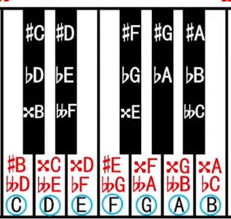

## 半音/全音

- **半音：** 两个音级之间的最小距离（音高相差多少Hz，具体数值不用关心）
- **全音：** 两个半音之和

- **自然：** 不考虑变音符号，两个音级在`CDEFGAB`循环序列中是相邻的
    

- **变化：** 不考虑变音符号，两个音级在`CDEFGAB`循环序列中不是相邻的
    

- **自然半(全)音**：两个音级（考虑升降符号了）在「自然」的前提下，相差半(全)音
- **变化半(全)音**：两个音级（考虑升降符号了）在「变化」的前提下，相差半(全)音

# 七音的扩展

## 变化音级

获取到变化音级，实在原来的基本音级上添加「变音符号」

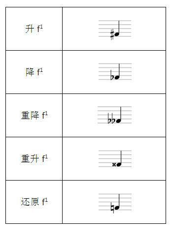

在基础音级 `CDEFGAB` 中引入上面的四个变音符号，就会导致同一个键会有多个音名

**等音：** 多个描述同一个音的音名之间关系。例如 `#C bD xB` 都描述的是同一个组内的同一个黑键，这三个音级就是等音。

> [!tip]
> 一个音之所以会有这么多名字，是为了在不同规则下，对这个音的描述更加直观、合理。例如在家里，父母和亲戚会叫你小名；在学校和工作中，同学和同事会叫你书名；在上网时，你用网名。不管怎么变，你还是你，只是为了适应不同的场合，用了不同的名称。

## 纯8度

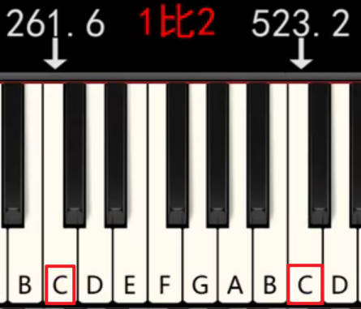

在钢琴键上两个相邻组中，同样音名的两个键其音高满足`1:2`的关系，这两个音的关系就被称之为「纯8度」。**这也是为啥可以键这些键利用`CDEFGAB`进行循环表示的原因，即两个音高满足倍数关系的音十分协和**。

## 音的分组

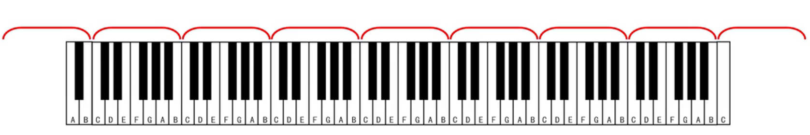

钢琴有`88`键，且划分为`9`组，每个组中按键名都是`CDEFGAB`，这样在一个组中，我们能轻松区分那个键是那个键，当时当有两个组时，同一个音名就对应了两个键，因此还需要有区分组的规则

### 霍尔姆茨音调记号法

1. 组名规定

    
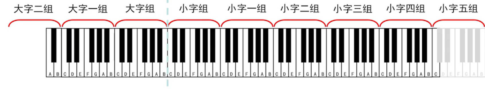

2. 音名规定
    
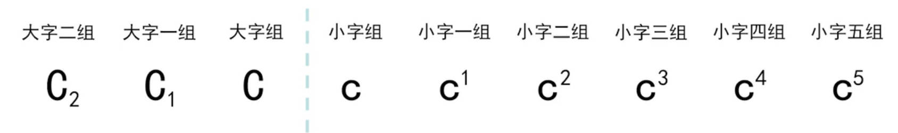

    - 大字组用大写音名，小字组用小写音名
    - 音名下标为大字组组号，音名上标为小字组组号

### 科学音调记号法

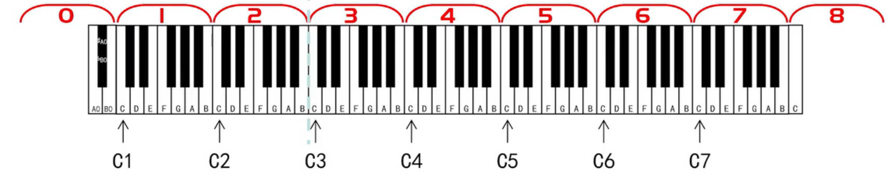

1. 组名规定：从左到右对钢琴按键组进行编号
2. 音名规定：大写音名加组号

### 简谱

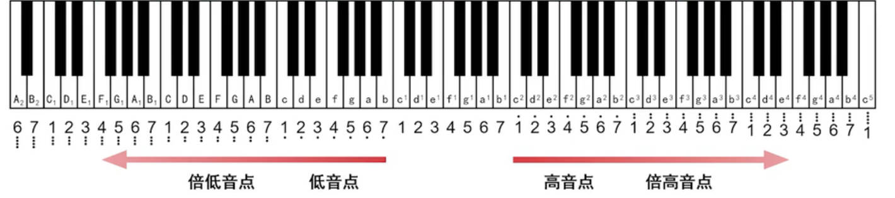

前面小节介绍了音名`CDEFGAB`如何进行分组。但是当我们使用简谱时，使用`1234567`来代替音名，那么音名的分组规则就不再适用，这里就改用高音点与低音点来标记。
- **一个点就代表纯8度的变化**
- **无高低音点的`1234567`的起始位置一般定位在「小字一组内」**。
    因为人的发音频率范围大概就是小字一组周围，并且小字一组位于键盘的中间位置，左右两边的高低音点就比较对称，都在`4`个以内。

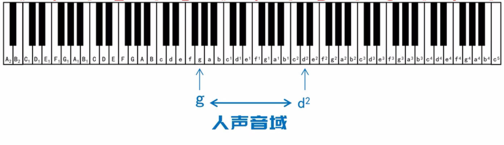

## 特殊音名

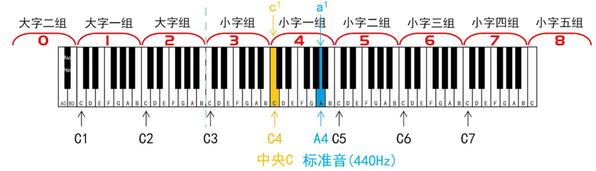

- **中央C**：小字一组的`C`音级
- **标准音**：小字一组的`A`音级，用来校准乐器的 

# 调号

## 作用

> [tip]
> 调号可以用来确定简谱中`1234567`表示的是那些音级

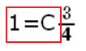

1. `1 (do)` 代表那个音级（音名），就从那个音名出发
2. 确定`1`后，按照 “全音-全音-半音-全音-全音-全音-半音” 顺序，从左向右循环遍历「十二平均律」得到 `234567` 代表的是哪个音级（音名）

    
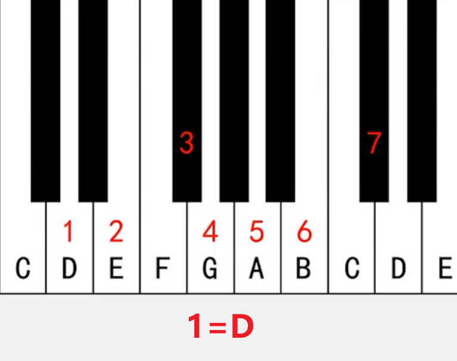
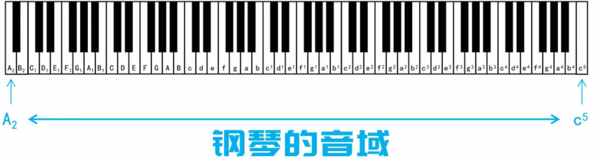

## 调号的起点

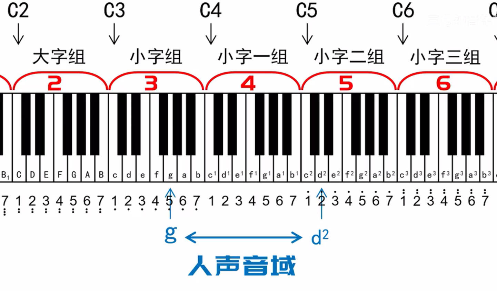

**人声的音域是包含了小字一组，并且简谱是给人用的，为了响应人体工程学，一般就把调号的起点放在了小字一组内，因此调号的`1`一般位于小字一组。** 

