# 调式

# 调式的定义

## 简谱规则

在简谱中，利用 $1234567\dot{1}$ 来表示音名，并且这几个数字又对应了唱名 `do ru mi fa so la xi`，为了让音谱代表的音名能够唱出 `do ru mi fa so la xi` 的感觉，就需要音谱代表的音级满足 「全音-全音-半音-全音-全音-全音-半音」。然后根据调号规则，可以得到如下能唱出 `do ru mi fa so la xi` 的音列

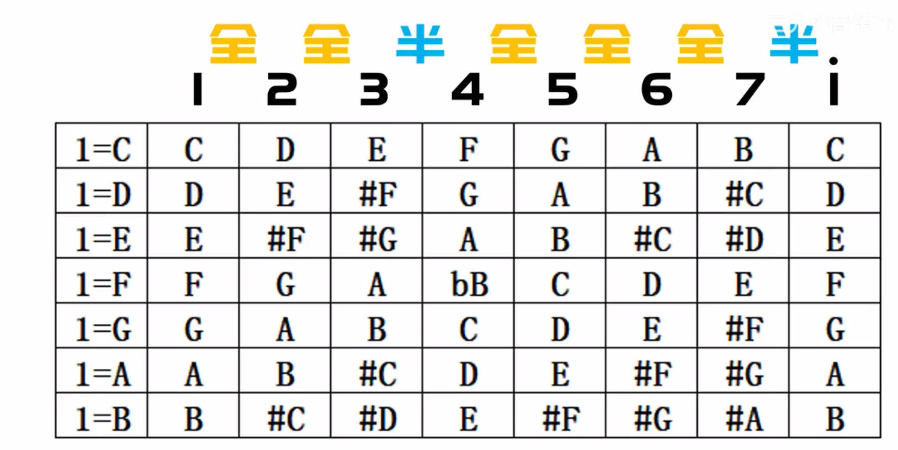

上面那张表一共有七种音列，我们跟别人交流，不会直接背这几个音列，为了方便起见又需要对这些音名序列定义一个通用的名字。

## 调式

**调式：** 若干个音，按照某种规则排列起来的集合。调式是一个抽象的概念，根据不同用处，就会详细定义这个概念（类似子类实现父类）

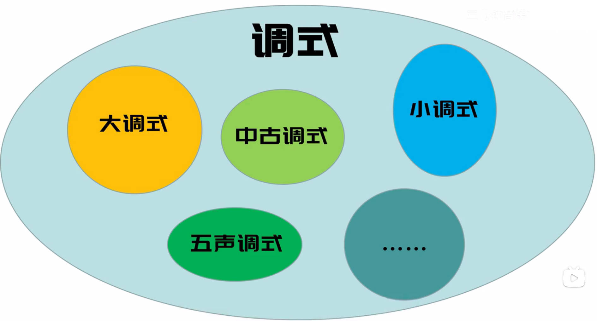

## 自然大调(式) 

**自然大调(式)：** 七个音（第一个和最后一个是一个音名，为了体现出循环）按照「全音-全音-半音-全音-全音-全音-半音」规则组成的集合。

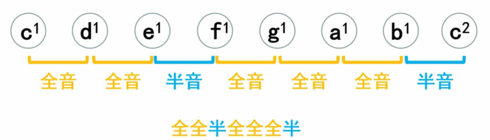

**自然大调只是定义了音名的排列规则，还得确定是从哪个开始排列的，这样才能区分表中的七个自然大调，这里就直接利用排列的第一个音名进行区分**

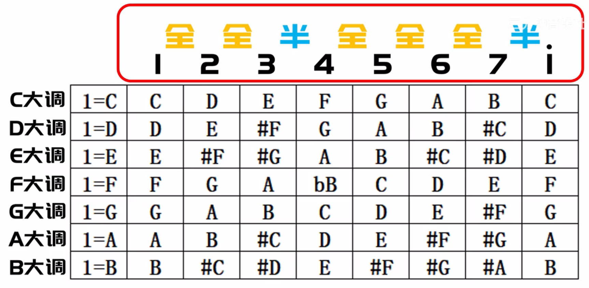

> [!tip]
> 调式限定了曲子只用哪几个音名

# 音阶

**音阶：** 将调式中的音，从以主音开始到以主音结束，由低到高（上行），或者由高到低（下行），以阶梯状排列起来。

- 主音开始，主音结束为一个阶梯。例如 C 大调，开始的音名为 C ，结束的音名为 C
- 音阶是有序。一个音阶，要么上行，要么下行，在上行中不能插入下行
    
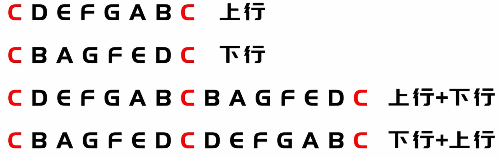

- 音阶中要包含调式中的所有音

**作用：** 音阶就是调式定义的具体实现

# 大调扩展

## 黑键的大调

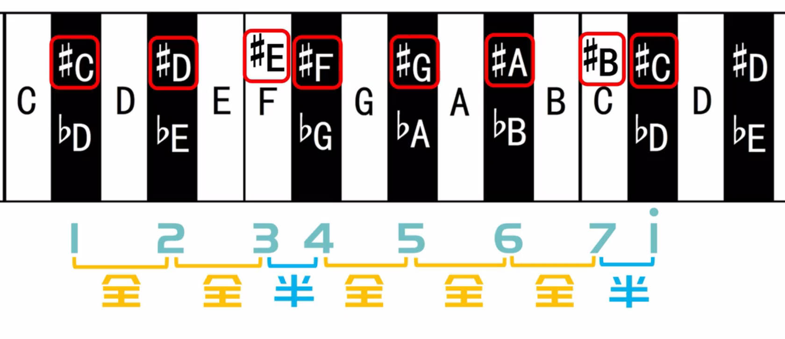

黑键的音名是由`CDEFGAB`通过变音符号变化而来的，同样黑键也能作为自然大调的起始。根据自然大调规则写出 #C 大调：

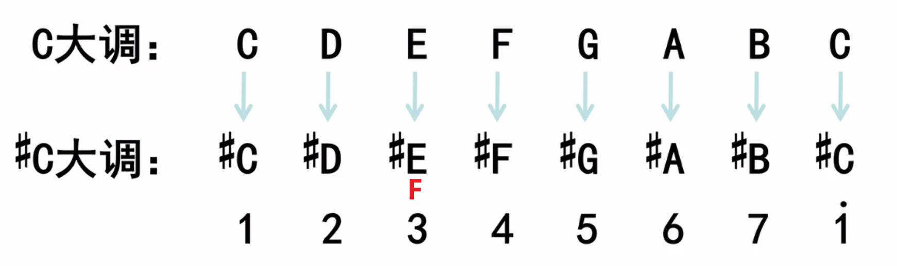

**在`3`位置，使用的是`#E`，而非`F`，这是因为大调的音阶要包含调式中的所有音名，并且`#E` 更能表现出 `#C` 的感觉。**

## 等音大调

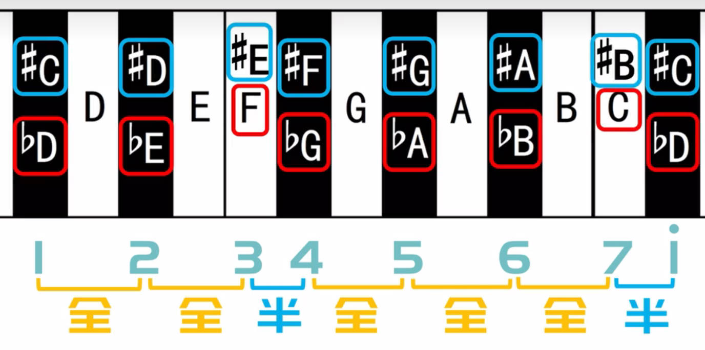

对于 #C 大调与 bB 大调而言，他们本质上的音都是等音的，因此 #C 大调与 bB 大调的之间的关系就被称之为「等音大调」

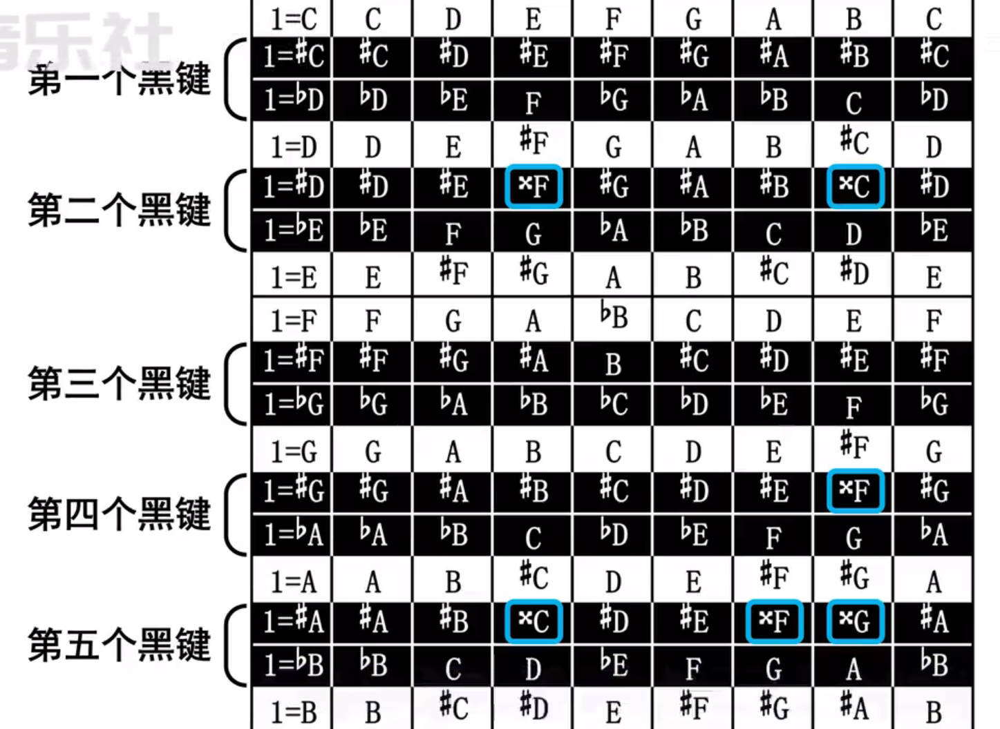

上图中用括号括起来的大调为等音大调，**但是由于重升与重降符号太复杂，用着麻烦，所以一般不会使用带有重升与重降的大调。** 

# 15类自然大调 

去掉所有带有重升与重降符号的大调，再添加一个 bC 大调，就得到了最常用的15个自然大调

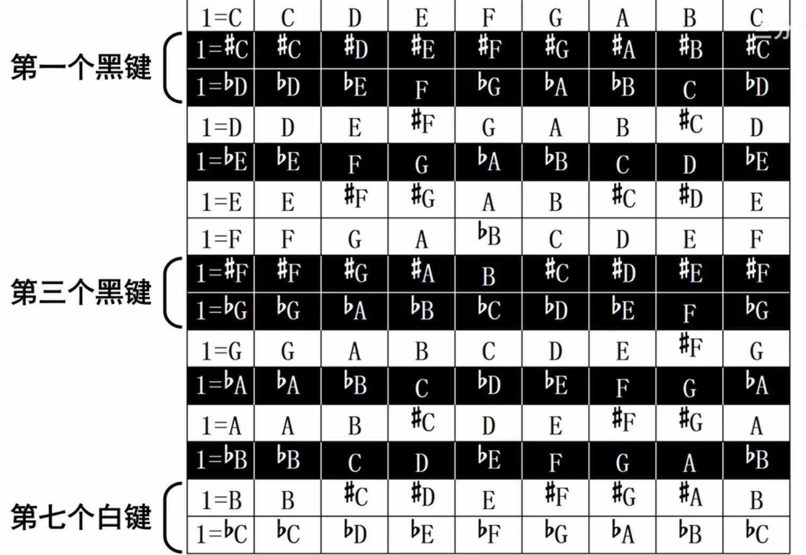

# 首调与固定调

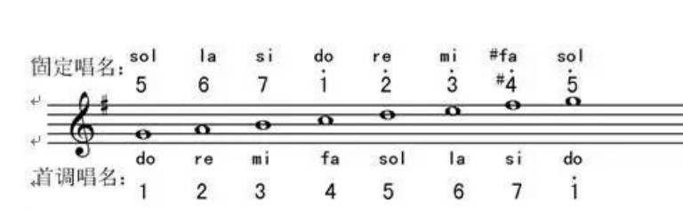

**首调：** 把任何一个大调的首音当作 1(do)。方便唱谱，不管什么调，谱子只是 1(do) 的起始音高不同

**固定调：** 无论什么情况下，C 与 1(do) 相对应。方便演奏，乐谱音符和乐器键位是对应的，不用再翻译一下

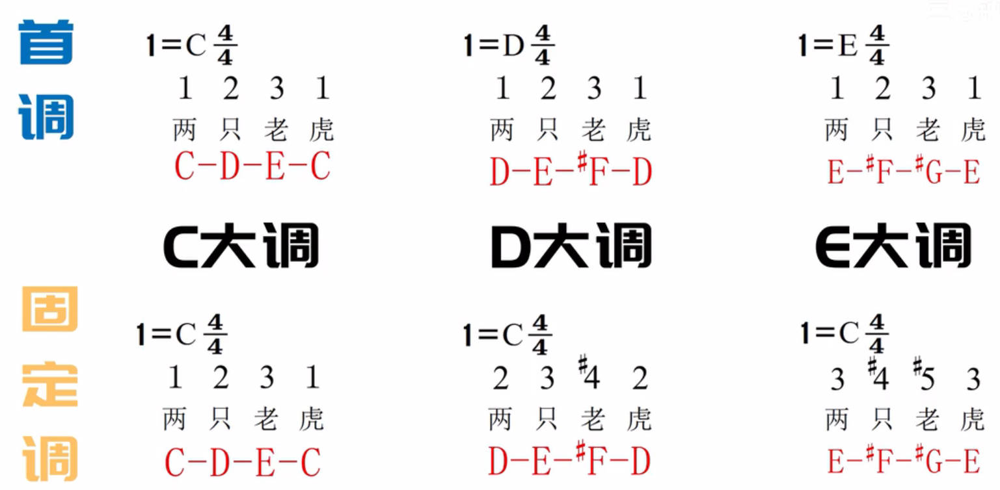

# 调的改变

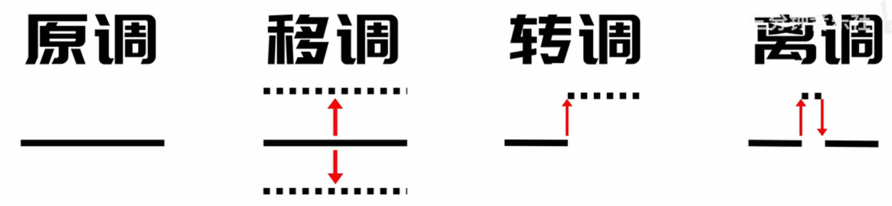

- **原调：** 乐谱调号描述的调式

- **移调：** 将乐谱的原调升高或者降低，**乐谱中的所有音级都要移动**。例如将C大调谱子按照D大调进行演奏。

- **转调：** 乐谱以一个调开始，然后又以另外一个调结束。例如前半部分为C大调，后半部分就变为了D大调
- **离调：** 短暂的离开原调，某几个音级离开原调，但是又马上返回原调

> [note]
> - 跑调：歌手唱的调和BGM的调不一样，例如歌手唱C大调，而配乐放的E大调
> - 歌手唱的调上升/下降纯八度，不算跑调，因为一个八度就是一个循环，还是在原来的调里面

