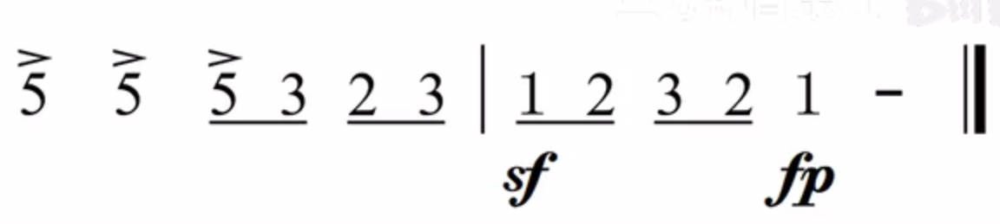
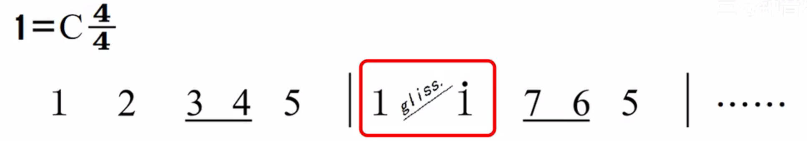

# 记号

# 力度记号

## 强弱记号

- `p`：piano，声音小的
- `f`：forte，声音大的

- 记号的作用范围为，起始于记号的出现，终止于下一个记号的出现
- 记号表达的是声音相对的强弱关系，只要有这个强弱关系就行。具体多强、多弱，自己把握

## 强弱渐变

- 从强到弱，逐渐变化
    

- 突然变强，然后马上变弱
    

## 突强/重音

- 突强与重音都是只放大指定的音符
- 重音比突强在变化上要弱一点

# 速度记号

- 音符的节奏不再跟随节拍，而是逐渐加快或者变慢
    

    在渐慢和渐快后，速度不会还原回去
    

- 在渐慢和渐快后，速度还原
    

- 适当延长音符演奏时间，一般为原音符的 [1.5, 3] 倍的
    

# 反复记号

## 反复一次

- 被「前反复记号」与「后反复记号」包裹的乐谱会被演奏两次
- 当前反复记号在乐谱的开头，可以省略不写

## 跳房子（路径切换）

演奏第一次时，进一房子；演奏第二次时，进二房子；三、四房子以此类推

## 标记点反复

- **D.C.与Fine**：遇到符号 D.C. 跳转到乐谱头部开始演奏，然后演奏到符号 Fine 结束
  

- **D.C.与Coda**：遇到符号 D.C. 跳转到乐谱头部开始演奏，然后演奏到符号 Da Coda 停止，并跳转到 Coda 符号继续演奏，Da Coda 与 Coda 中间的部分不演奏
    

    换一个符号
    

- **D.S.**：D.C. 是从头开始反复，而 D.S. 是从符号 S 处开始反复
    

# 省略记号

- 单音震音：斜线表示实际音符下方的横线；实际音符的总时值与记号音符时值相等
    

- 双音震音：斜线表示实际音符下方的横线；实际音符的总时值与记号音符某一音符的时值相等
    

- 小节反复
    重复一次
    

    重复两次：把符号画到小节线上
    

# 演奏记号

## 断音记号

**断音**：音符要演奏得短促，理论为原本音符时值的 $\frac{1}{4}$ 或者 $\frac{1}{2}$

**连断音：** 音符演奏连续又断开，理论为原音符的 $\frac{3}{4}$ 的时值

## 滑音

**单个音符：**
- 上滑音：演奏当前音符时，由某一音高开始，渐渐升高到音符的音高
- 下滑音：演奏当前音符时，由音符的音高开始，渐渐下降到某一音高

**两个音符：**
- 上滑音：左边音符开始，渐渐升高到右边音符音高
- 下滑音：左边音符开始，渐渐降低到右边音符音高

## 刮奏

滑音描述的是人唱出来的效果，刮奏是描述乐器演奏的效果。上述的 $1 \rarr \dot{1}$ 的刮奏，在乐器演奏上就是在 $1$ 的时值内，快速演奏 $1,2,3,4,5,6,7,\dot{1} $ 

## 琶音

一个音符时值内，竖向上的音符几乎同时地快速演奏，先后顺序默认从下往上

# 装饰音记号

## 基础概念

- **级进**：忽略升降符号，两个音之间不存在其他唱名（即两个音是挨着的），那么前一个音到后一个音就是级进
- **跳进**：忽略升降符号，两个音之间存在其他唱名（即两个音不是挨着的），那么前一个音到后一个音就是跳进
- **经过音**：有三个音，从左到右，为两个「同向的级进」
    

- **辅助音**：有三个音，从左到右，为两个「反向的级进」
    

> [!note]
> 经过音与辅助音不能位于强拍上，或者强节奏位
> 

> 

## 助音

- **辅助音**
    

- **跳进级出的助音**：先跳进，然后再级进，例如 6 3 4，3 是 4 的跳进级出的助音
- **级进跳出的助音**：先级进，然后再跳进，例如 3 4 1，4 是 1 的级进跳出的助音
- **环绕助音**：有五个音，并且二四位置的音符为「辅助音」，那么二四位置的音就是环绕助音
     

## 波音

**上面表格的「实际奏法」，下划线多的音符表示，这几个音符要快速演奏出来**

上波音，升降记号写上方

下波音，升降记号写下方

## 回音

一个回音标记对应四种演奏方式
- 红框演奏方式：四个音符均分回音音符的时值
- 绿框演奏方式：前三个音占回音音符的一半时值，第四个音占另外一半时值

## 颤音

颤音有三演奏方式，起始不一样，主体重复内容为标定音符与其「上助音」的重复。主体需要一直重复到被标记音符的时值结束

## 倚音

一般说的倚音为「短倚音」，倚音需要快速演奏，倚音下方的横线没有实际音符含义，只是标记出倚音要快速演奏
